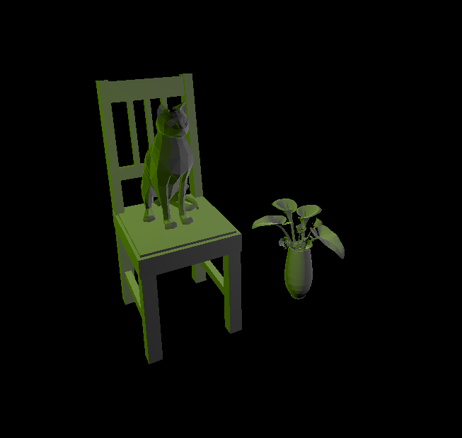
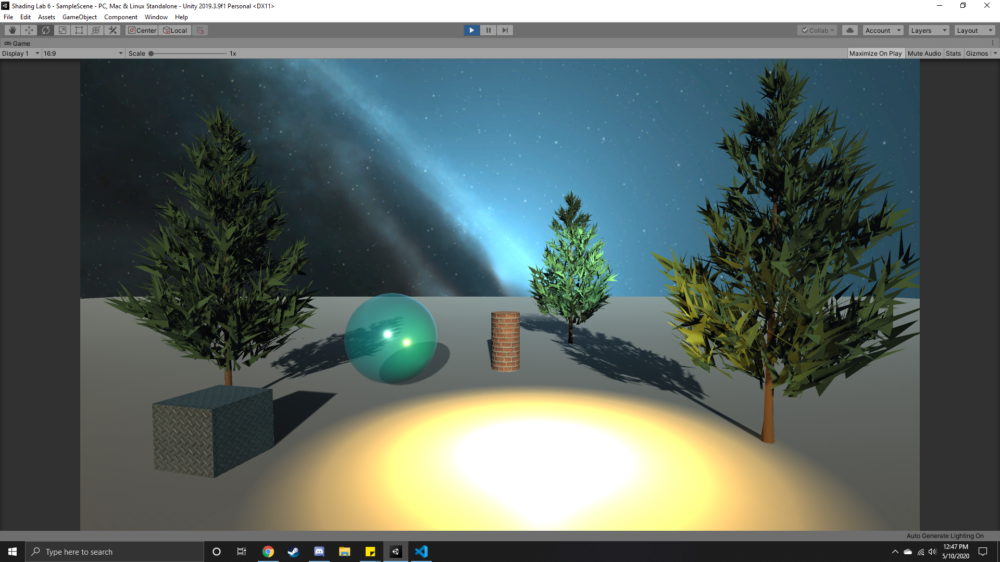
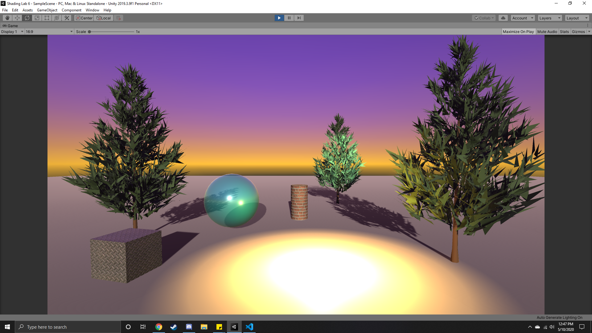
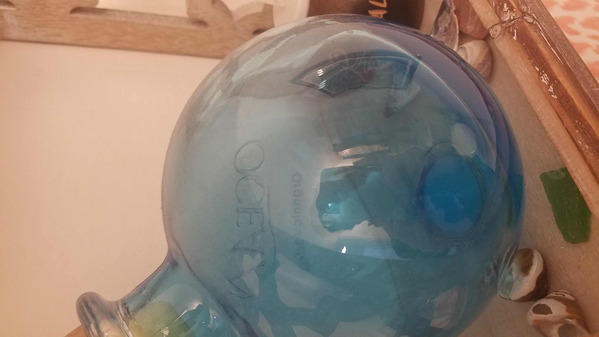
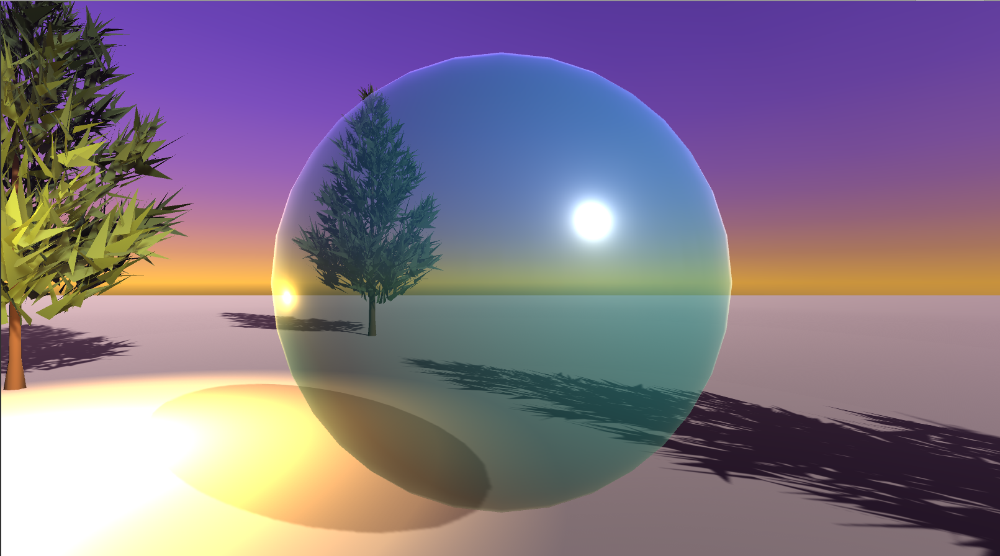

# CMPM163Labs
LAB 2

Part 1 Video: https://drive.google.com/file/d/1_DB0JUPH8TkMiO0voPH5Cuohx5Hr33dy/view?usp=sharing

LAB 3

Video: https://drive.google.com/file/d/1Ijrx45119McJHbOBVCSIvfvnGQzZzDel/view?usp=sharing

How each cube was made (Top-left to bottom-right):
- Basic material with orange color, transparent = true and wireframe = true. Inspired by one of the example spheres: https://threejs.org/examples/#webgl_materials
- Extra shader added by me. This one uses rainbowShader.frag, which assigns fragment color based its position, creating a rainbow effect.
- Built using the part 1 instructions. Uses Phong material and specularity.
- Built using the part 2 instructions. Uses vertexShader.vert and fragmentShader.frag, assigning the two uniform vec3 colors to pink and purple.
- Normal material with no assigned values. Also inspired by an example sphere: https://threejs.org/examples/#webgl_materials

LAB 4

Video: https://drive.google.com/file/d/1ioyDnqnDTO2mrcfU4Y1clFABVQVgpIYX/view?usp=sharing

Questions
1. u * 8 = x or u * 8 - 1 = x?
2. |v * 8 - 8| = y or |v * 8 - 8| + 1 = y?
3. 0.375 * 8 = 3 - 1 = 2
   - 0.25 * 8 = 2 - 8 = 6
   - (3, 5) or (2, 6) = blue, grey. Depnds on if we are starting on 0 or 0.125

How each cube was made:
1. (Bottom-left) Created using THREE's texture loader and built-in Phong material. The light orbiting around the cubes was achieved by placing it above them, then translating it along the Z-axis and rotating it around the Y-axis.
2. (Bottom-middle) Same as #1, but with the corresponding normal map added on.
3. (Middle-left) Same as #1, using a different texture.
4. (Middle-middle) Same texture as #3, but with corresponding normalmap
5. (Bottom-right) Same as others, but with a mis-mateched texture and normal map.
6. (Middle-right) Created by loading vertex and frag shaders from lab3. First, the uniform was set to oscollate between two colors before being replaced by loading a texture. The color of each fragment is determined by using the uv coordinates and finding the corresponding color on the texture.
7. (Top) Created using an adjusted frag shader called tile.frag. By multiplying the uv coordinates by 2, the sampler looks twice ahead on the textue (so for example, 0.5 would instead retrieve the color for 1.0), resulting in the texture only taking up a quarter of the space. I found that the small texture could be 'moved' around the cube by subtracting a vector from the uv coordinates, so I used if statements to determine what vector should be subtracted (you can see this code commented out on tile.frag). However I eventually found that this could be done more efficiently by subtracting a vector whose x and y values were floor(vUv + 0.5). x/y will be 0.0 if vUv is less than 0.5 and 1.0 if vUv is greater than 0.5.

LAB 5

Video: https://drive.google.com/file/d/16fcXPUOWzqHdbiObPPT6L8cwllma07R0/view?usp=sharing

In addition to doing the particle system tutorial, I made various changes to transform the scene from an evening setting to a nighttime one. These changes/additions include:
1. Changed skybox tint color and enviromental lighting. These are both accessed from window->rendering->lighting, where I changed the enviromental lighting to a darker shade of blue. Then I edited the tint color of the skybox material to make it fully black.
2. Changed position and rotation of the sun light source.
3. Changed emission color of the sun light source to a blue color (accessed in Assets>Karting>Art>Materials>Level)
4. Added a moon sprite to the sun object's Albedo map. (Albedo basically means a texture without shadows or highlights)
5. Created a particle system to represent fireflies and placed it around the map. The system emits particles in a sphere shape and they have a random start speed between -3 and 3. The random speed, in addition to a random velocity over time, causes the particles to appear in various locations within the circle and drift in a mostly random direction.
6. Additionally, the alpha of the firefly particles changes over time so that they appear to blink in and out of vision.

LAB 6

Lights:
1. Point Light: A light in space that shines in all directions. Rotation is irrelevant.
2. Directional light: Shines on all objects in the scene based on its rotation, similar to the sun. Position is irrelevant.
3. Spot Light: Shines light on objects within a cone, of which the radius and other properties can be adjusted. Affected by rotation and position. (A bit tricky to see but it's on the tree in the back)
4. Area Light: Shines light on all objects on one side of a rectangular plane. Only works with baked lighting.

Glass Material
- This material is based off of a decoration in my house. It uses the standard shader and transparent rendering mode to be see-through, along with an alpha value of 110. To give it a shiny appearance, its smoothness is turned up to 0.8.

Textures: 

Both textured objects in the scene (the cube and the cylinder) use textures and normal maps provided to us in Lab4. These images are applied to the albedo and normal maps of a material which can then be used to give objects the texture. I also adjusted the metallic and smoothness properties to match the intended material.

Skyboxes:

I decided for fun to create two skyboxes for this lab: The first one is procedurally generated by Unity, by creating a material and giving it the skybox>procedural shader. The second (space) one is a six-sided skybox that uses free images from the Unity asset store.
